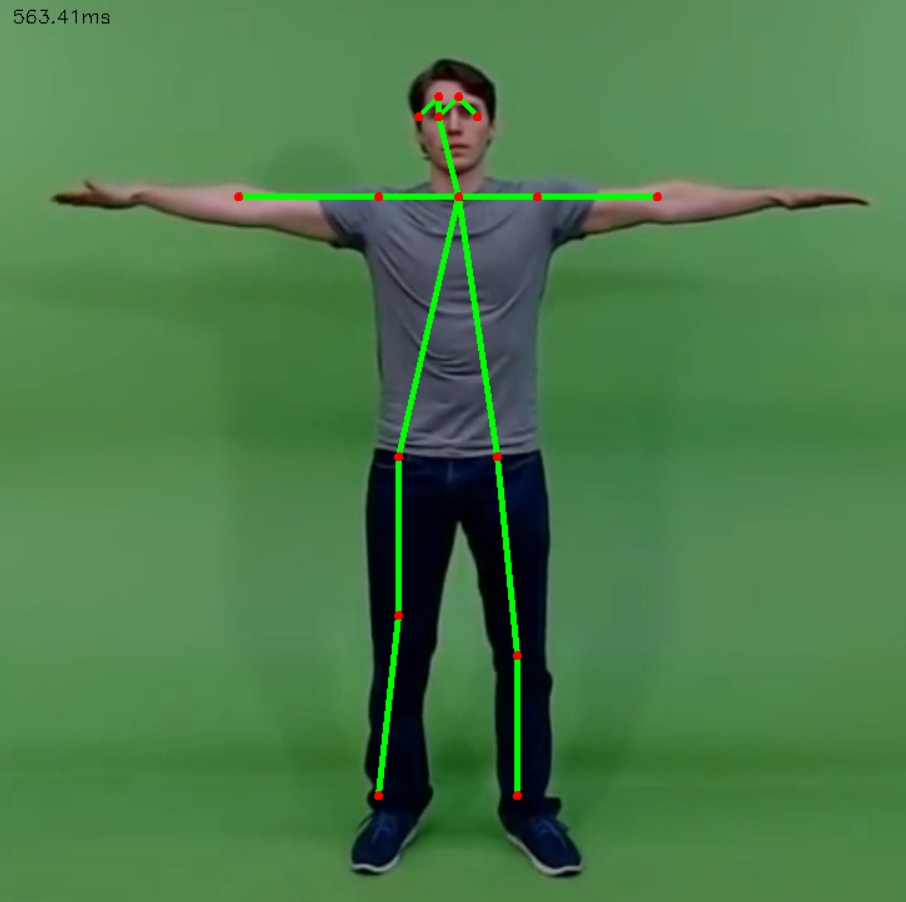

# human-pose-estimation-opencv
Perform Human Pose Estimation in OpenCV Using OpenPose MobileNet




# How to use

- Test with webcam

```
python openpose.py
```

- Test with image
```
python openpose.py --input image.jpg
```

- Use `--thr` to increase confidence threshold

```
python openpose.py --input image.jpg --thr 0.5
```

# Sources
https://github.com/quanhua92/human-pose-estimation-opencv   
https://github.com/CMU-Perceptual-Computing-Lab/openpose/blob/master/doc/faq.md   

